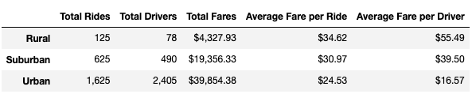
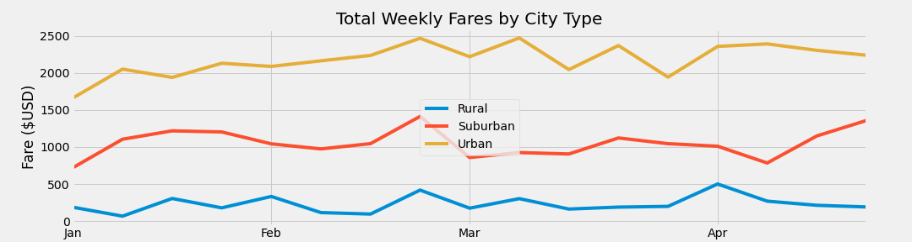

# PyBer Analysis

## Overview
The CEO of PyBer, V. Isualize, has requested an additional analysis on the Ride Sharing data by city type. In this new analysis, I will be creating a multiple-line graph that shows the total weekly fares for each city type, Urban, Suburban, and Rural during the time frame of January until May of 2019.  I will then present a written report that summarizes how the data differs by city type and how those differences can be used by decision-makers at PyBer.

### Resources
* Data Source: city_data.csv, ride_data.csv
* Software: Python 3.7.10, Jupyter Notebook 6.3.0, Matplotlib 3.4.3
 
## Results 
### Summary Data of each City Type

---
Above shows the analysis of the different city types, <u>Urban, Suburban</u> and <u>Rural</u>, in the areas of <u>Total Rides, Total Drivers</u> and <u>Total Fares</u>.  Then I calculated the <u>Average Fare per Ride</u>, and <u>Average Fare per Driver</u>.  I am going to break down what this tells us:

_Total Rides:_ 
* In Urban areas, like cities, ride-sharing is used the most, in which we would expect. Most people would prefer not to own a car, or drive one into the city, as the parking is either hard to find, or too expensive to store their car during the day/night.  So it was expected to be larger there. 
* In Suburban areas, there are less people than cities, I expected that number to drop, but still have quite a few ride-shares in our time frame. People still got into town, to work, to malls, to airports, and every day activities. 
* The Rural area, is where I also expected to be a few ride shares, so 125 is what we at PyBar would seem reasonable.  Folks out in the rural areas, live far outside of town, so they plan their trips into town and have transportation lined up with their own or neighbors.

_Total Drivers:_ Again these numbers follow the Total Rides, and this would be in line with the demand of requests. 
* **Urban** areas have a high demand, so more drivers would need to be available to meet the demand, it would cut back in **Suburban** areas and further back into the **Rural** areas.  I thought it was most interesting that the number of drivers in the Rural areas was almost as much as the rides.  So it seems to be so few that the drivers are almost a 1 or 2 time driver in the Ride Share business.

_Total Fares:_ It is as expected that the amount of money would follow the same pattern that more rides would make more money, and this analysis didn't disappoint.
* Urban areas with almost $40k, Suburban areas with almost $20k and Rural with a little over $4k.

#### Here is where the numbers get interesting
_**Average Fare per Ride:**_ I wasn't as shocked to see the opposite trend in the average calculations from what we saw above, for a few reasons.
* **Urban** areas have shorter distances to travel, as most are going to be within the same city or to an airport at the edge of a city. Urban fares can combine passengers so each passenger can get a discount which can lower the fares.  Passengers can sign up for a regularly scheduled pickup/dropoff, so the company can offer a discount on pre-paid monthly passes.  
* **Suburban** areas, again I would expect them to be more than Urban and less than Rural as trips to doctors or into town would take a longer travel time, but several suburban cities still have busses, and those that need ride sharing the trip times wouldn't be hours and could still be a resonable price range that many could afford this more often.
* <u>Rural</u> areas, again to find someone to come out to your farm and then take you back into town, wait for your to finish your errands, or take you into the city to an airport, these trips are long, and will require quite a bit of gas.  I would expect that these fares would be higher.

_**Average Fare per Driver:**_ As I felt above, the larger the number of drivers, breeds competition, the ability to share rides with others, and the offering subscriptions with prepaid passes and other benefits. This will allow a driver to be able to build up their clientele and still make more money with giving these little discounts. So for those reasons, I believe that is why the Urban area drivers fares are the lowest.
* **Urban** drivers will have the numbers of clients to offer these benefits.
* **Suburban** drivers won't be able to, so their prices will be higher and the distance will drive their prices.  
* **Rural** drivers, they pretty much can set their prices as the demand is low, and those that need it, will pay what is asked.

Manager Omar - work with me to get the visualization correct

rideshare data from January to early May 2019

analyyze all the rideshare data  - create a compelling visualization for the CEO, V. Isualize

V - is a former programmer, who started out at MathWorks, a co-founder of PyBer, and is known for being extremely fair, yet extremly demanding.
analytical work needs to be comprehensive and correct.

Your CEO will most likely ask why you chose the charts you did, so you'd better be prepared to answer.
The best chart that can relay data over a period of time is a line chart, and when you want to compare 3 different 'types of data', like Type of city, Urban, Suburban and Rural, over a period of time in the Ride Share business this was the best option to present the data, in a clear and accurate fashion.

## Summary

### need a subheading
-- Based on the results, provide 3 business recommendations to the CEO for addressing any disparities among the city types.

