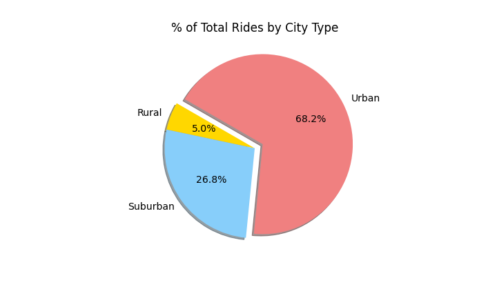
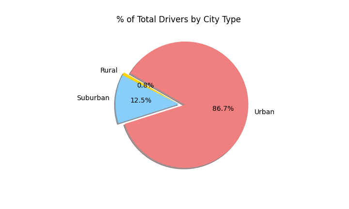
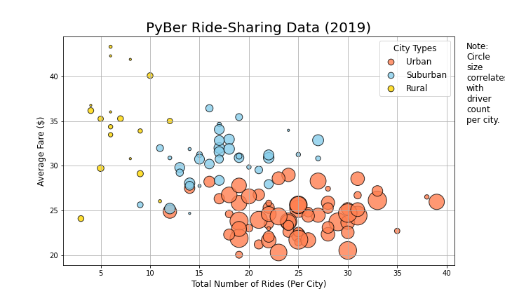

# PyBer Analysis

## Overview
The CEO of PyBer, V. Isualize, has requested an additional analysis on the Ride Sharing data by city type. In this new analysis, I will be creating a multiple-line graph that shows the total weekly fares for each city type, Urban, Suburban, and Rural during the time frame of January until May of 2019.  I will then present a written report that summarizes how the data differs by city type and how those differences can be used by decision-makers at PyBer.

### Resources
* Data Source: city_data.csv, ride_data.csv
* Software: Python 3.7.10, Jupyter Notebook 6.3.0, Matplotlib 3.4.3
 
## Results 
### Summary Data of each City Type

---

Above shows the analysis of the different city types, <u>Urban, Suburban</u> and <u>Rural</u>, in the areas of <u>Total Rides, Total Drivers</u> and <u>Total Fares</u>. The First 3 columns are broken down as follows:

_Total Rides:_ 
* In **Urban** areas, like cities, ride-sharing is used the most, in which we would expect. Most people would prefer not to own a car, or drive one into the city, as the parking is either hard to find, or too expensive to store their car during the day/night.  So it was expected to be larger there. 
* In **Suburban** areas, there are less people than cities, I expected that number to drop, but still have quite a few ride-shares in our time frame. People still got into town, to work, to malls, to airports, and every day activities. 
* The **Rural** area, is where I also expected to be a few ride shares, so 125 is what we at PyBar would seem reasonable.  Folks out in the rural areas, live far outside of town, so they plan their trips into town and have transportation lined up with their own or neighbors.

_Total Drivers:_ Again these numbers follow the Total Rides, and this would be in line with the demand of requests. 
* **Urban** areas have a high demand, so more drivers would need to be available to meet the demand, it would cut back in **Suburban** areas and further back into the **Rural** areas.  I thought it was most interesting that the number of drivers in the Rural areas was almost as much as the rides.  So it seems to be so few that the drivers are almost a 1 or 2 time driver in the Ride Share business.

_Total Fares:_ It is as expected that the amount of money would follow the same pattern that more rides would make more money, and this analysis didn't disappoint.
* Urban areas with almost $40k, Suburban areas with almost $20k and Rural with a little over $4k.

### Now lets look these totals visually

Urban cities saw more than 2/3 of the total rides during the first 4 months of 2019. Suburban cities saw 26.8%, and Rural cities with the smallest portion of only 5%.

---

Drivers in Urban cities were by far the biggest majority with 86.7% of the companies force in the first 4 months of 2019.  Suburban drivers made 12.5% of the drivers and Rural 0.8% of the drivers in PyBar.

---

Urban cities definitely have the focus of PyBar's business model with 62.7% of the first 4 months of total fares in 2019. Suburban fares came in at 30.5% of the total fares with Rural cities coming in with 6.8%

### The average fare per ride and driver by city
The following chart showss us the relationship between the average price per share and the number of rides and drivers per city type.

* From this chart we notice that the average fare tends to decrease as the total number of rides increase in each city type. 
* We also notice that the per driver count per city type, the bubbles get larger as the average fare decreases and/or when the total number of rides increase.
* Rural cities show the least amount of drivers and the number of rides overall and their fares range from the middle to the highest.

We don't have any information regarding the actual population sizes of these cities, but we can make some educated guesses on why these 3 relationships are showing.

_**Average Fare per Ride:**_ I wasn't as shocked to see the opposite trend in the average calculations from what we saw above, for a few reasons.
* **Urban** areas have shorter distances to travel, as most are going to be within the same city or to an airport at the edge of a city. Urban fares can combine passengers so each passenger can get a discount which can lower the fares.  Passengers can sign up for a regularly scheduled pickup/dropoff, so the company can offer a discount on pre-paid monthly passes.  
* **Suburban** areas, again I would expect them to be more than Urban and less than Rural as trips to doctors or into town would take a longer travel time, but several suburban cities still have busses, and those that need ride sharing the trip times wouldn't be hours and could still be a resonable price range that many could afford this more often.
* <u>Rural</u> areas, again to find someone to come out to your farm and then take you back into town, wait for your to finish your errands, or take you into the city to an airport, these trips are long, and will require quite a bit of gas.  I would expect that these fares would be higher.

_**Average Fare per Driver:**_ As I felt above, the larger the number of drivers, breeds competition, the ability to share rides with others, and the offering subscriptions with prepaid passes and other benefits. This will allow a driver to be able to build up their clientele and still make more money with giving these little discounts. So for those reasons, I believe that is why the Urban area drivers fares are the lowest.
* **Urban** drivers will have the numbers of clients to offer these benefits.
* **Suburban** drivers won't be able to, so their prices will be higher and the distance will drive their prices.  
* **Rural** drivers, they pretty much can set their prices as the demand is low, and those that need it, will pay what is asked.

### Ride Sharing data by city type
---

The above chart shows the **Total Weekly Fares** over the period of time from January until May 2019.  Each city type, **Urban, Suburban** and **Rural**, is represented by a different line on the chart.  A few analysis points to notice:
1. All 3 city types jump up in the last week of February.
2. All 3 city types drop the first week of March.
3. Rural cities stay pretty much in the 0 to $500 total fares.
4. Suburban cities stay with in the $500 to $1500 total fares.
5. Urban cities stay within the $1500 to $2500 total fares.

So knowing how the analysis came out from our data above, and now our new analysis with the data over the period of time from January through April 2019, we can look at these new points of interest and see how we can go forward in our business model at PyBar.

## Summary

* The Urban cities are still your most utilized and most profitable areas. The trends I have shown is the higher number of drivers, the more rides are handled and the lower the average fares are coming in. Cities have large competition for ride share companies and the people want friendly drivers, clean cars and cars there when they need them.  I think focusing on how we can retain our drivers, recruit more drivers and offer our riders incentives and the best ride to continue to use our service over others, will increase our ride share with other companies such as Uber, Lyft, Curb and many others.
* Suburban cities are still a large share of our ride share service, marketing our application and setting routes in well known smaller cities and larger towns, could really bring up those areas in which more people will want to ditch their cars and use our service.  We currently only have about 17% of our drivers in suburban areas, but they currently make up 30% of our total fares, so that can definitely increase our revenue, even if we discount rates to set routes, and make our PyBar app easier to use, with a set of known routes in each town and have set fares with a discount.
* Rural towns and counties are our most underserved areas, and this would be a tough area to expand on as the cost might not be returned. There are just a few drivers and the fares are high due to the length of time it takes to get out to most of these peoples homes to pick them up and then take them to their destination.  We would have to obtain more data, such as geographic size, travel distance, number of travelers each ride, before we could really break down the rural averages to see if 1 or more would make investing more drivers into their areas.

Overall, making our PyBar Mobile application more user friendly as technology advances at a rapid pace is always a way to go. Setting up ways for pre-set trips and ones a person can save on their phone, to make it easier for them to just pull up our app and choose, could make the difference of choosing us versus one that they had to always enter who they are, where they are, where they want to go.  Setting up accounts and set routes and keeping incentives for so many rides per month, would also help retain riders.

Thank you for allowing me to perform this analysis for you. If you have any questions about this report, please let me know and I would be happy to answer them for you.

Jill Hughes
